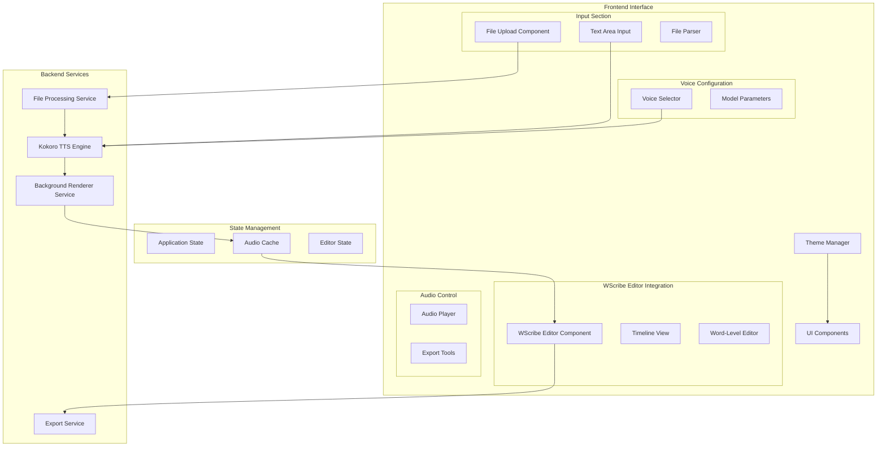
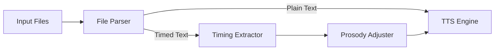
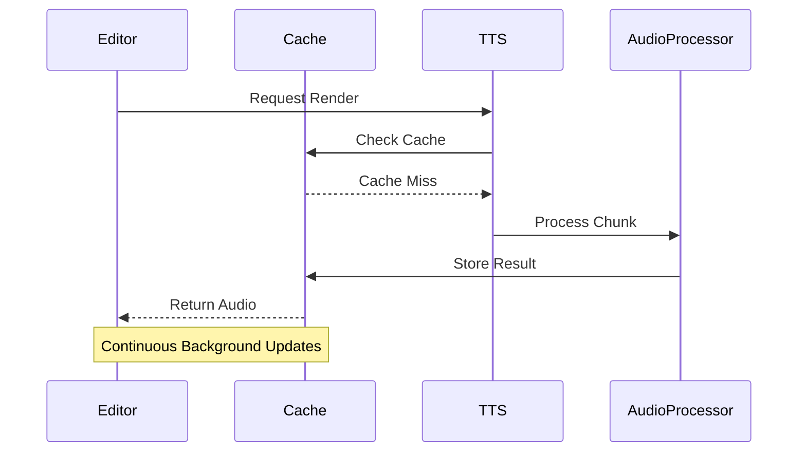
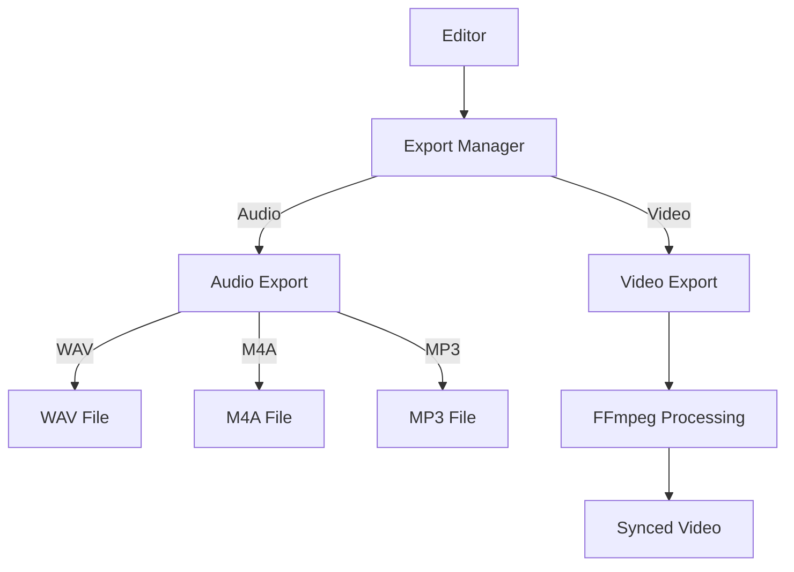

# Kokoro TTS System Architecture

## System Overview

## Implementation Checklist

### Phase 1: Core Input & WScribe Integration (1 hour)
#### Input Processing
- [ ] File Upload Component (20 min)
  - [ ] Multiple file upload support
  - [ ] File type validation (.txt, .srt, .vtt, .ass)
  - [ ] Drag-and-drop implementation
  - [ ] Progress indicator
- [ ] Text Parser Service (20 min)
  - [ ] Plain text parsing
  - [ ] SRT timing extraction
  - [ ] VTT parsing
  - [ ] ASS subtitle parsing
- [ ] Input Organization (20 min)
  - [ ] Accordion-style UI
  - [ ] Primary section for file uploads
  - [ ] Secondary section for direct text input

#### WScribe Editor Integration
- [/] Editor Setup (Started: 2025-02-11T06:38:00-05:00)
  - Initial repository analysis complete
  - TODO: Component structure analysis
  - TODO: State management integration
  - TODO: Event handling setup
- [ ] Background Processing Foundation
  - [ ] Basic TTS rendering service
  - [ ] Initial cache structure
  - [ ] State synchronization setup

### Phase 2: Voice Selection & Audio Processing (1 hour)
#### Voice Configuration (30 min)
- [ ] Voice Selection Interface
  - [ ] Voice list fetching
  - [ ] Preview capability
  - [ ] Favorite/Recent voices
- [ ] Model Parameters
  - [ ] Speed control
  - [ ] Pitch adjustment
  - [ ] Prosody mapping integration

#### Audio Processing (30 min)
- [ ] Player Implementation
  - [ ] Basic playback controls
  - [ ] Waveform visualization
  - [ ] Time markers
- [ ] Export Capabilities
  - [ ] WAV export
  - [ ] M4A export
  - [ ] MP3 export
  - [ ] Video sync foundation

### Phase 3: Theming & UI Polish (1 hour)
#### Theme System (30 min)
- [ ] Theme Manager
  - [ ] Dark/Light mode toggle
  - [ ] Theme Variants Implementation:
    - [ ] Brutalist
    - [ ] Skeuomorphic
    - [ ] Glassmorphic
    - [ ] Retro
  - [ ] Theme persistence
  - [ ] Dynamic theme switching

#### Performance Optimization (30 min)
- [ ] Audio Caching
  - [ ] Cache strategy implementation
  - [ ] Cache cleanup
- [ ] Background Processing
  - [ ] Worker thread management
  - [ ] Progress tracking
- [ ] State Management
  - [ ] Efficient state updates
  - [ ] Undo/Redo capability

## Progress Tracking
- Total Tasks: 35
- Completed: 0
- In Progress: 1
- Not Started: 34

Last Updated: 2025-02-11T06:38:00-05:00

## Technical Specifications

### File Format Support

### Background Rendering System

### Export Pipeline

## Component Dependencies

- Frontend Framework: React/Vue.js
- Audio Processing: Web Audio API
- File Processing: FFmpeg.js
- Editor: WScribe Editor
- State Management: Redux/Vuex
- Styling: CSS Modules/Styled Components
- Build Tools: Vite/Webpack

## Notes

- The background rendering system should maintain a buffer of processed audio to ensure smooth playback during editing
- Theme switching should be immediate and not require page reload
- File processing should be handled in chunks to prevent UI blocking
- All timing-sensitive operations should be handled with high precision for accurate lip-sync
- Cache management should be intelligent to prevent memory issues with large files
